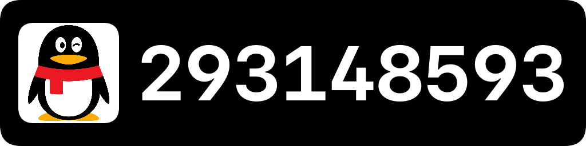
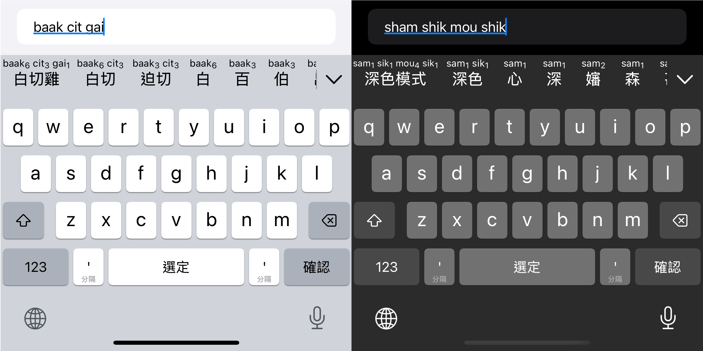
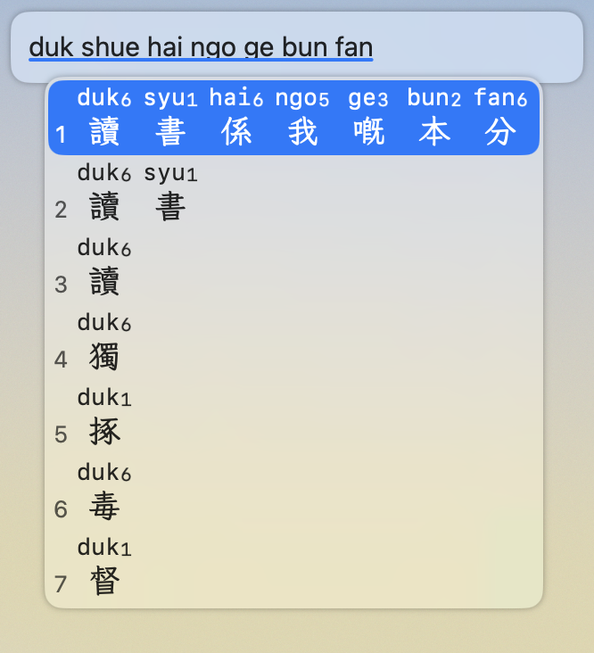
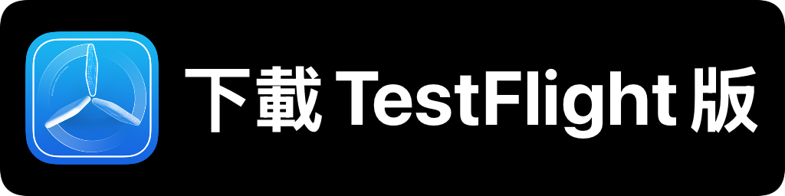
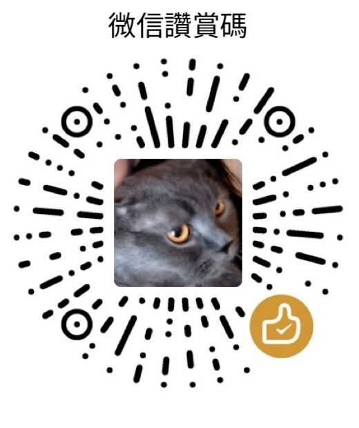

README in [粵語(Cantonese)](README.md) | [English](README-en.md)

粵拼輸入法
======

 
 

iOS、iPadOS 及 macOS 粵語拼音輸入法。

採用 [香港語言學學會粵語拼音方案](https://jyutping.org/jyutping) (粵拼 / Jyutping)，兼容各種習慣拼寫串法。  
候選詞會標注對應的粵拼。  
支持簡、繁體漢字及各種字形標準。  
可以用倉頡、速成、筆畫、普通話拼音、拆字等反查粵語拼音。

另有 Android 版: [yuetyam/jyutping-android](https://github.com/yuetyam/jyutping-android)

## 擷屏（Screenshots）

 

## iOS & iPadOS

 

 
 

 

 
 
兼容系統： iOS / iPadOS 16.0+

## macOS
由於 [第三方輸入法無法上架 Mac App Store](https://developer.apple.com/forums/thread/134115) ，請前往 [網棧](https://jyutping.app/mac) 下載安裝，或者用 [Homebrew 安裝](https://jyutping.app/mac/homebrew) 。

選項䈎面： 輸入法按 <kbd>Control</kbd> + <kbd>Shift</kbd> + <kbd>`</kbd> (位於 esc 鍵下方) 會顯示一個選項䈎面。  
常問問題： [常問問題（FAQ）](https://jyutping.app/faq)  
兼容系統： macOS 13 Ventura 或者更高。

## 如何構建（How to build）
前置要求（Build requirements）
- macOS 15.0+
- Xcode 16.0+

倉庫體積比較大，建議加 `--depth` 來 clone：
~~~bash
git clone --depth 1 https://github.com/yuetyam/jyutping.git
~~~
先構建數據庫 (Prepare databases)：
~~~bash
# cd path/to/jyutping
cd ./Modules/Preparing/
swift run -c release
~~~
接着用 Xcode 開啓 `Jyutping.xcodeproj` 即可。

整個工程(project)包含 `Jyutping`, `Keyboard`, `InputMethod` 三個目標(target)。  
`Jyutping` 是正常App，`Keyboard` 是 iOS Keyboard Extension，`InputMethod` 是 macOS 輸入法。

注意事項: 不要直接 Run `InputMethod`，只可以 Build 或 [Archive](https://developer.apple.com/documentation/xcode/distributing-your-app-for-beta-testing-and-releases#Create-an-archive-of-your-app)

如果要自己本機測試 Mac 輸入法，請將 Archive & Export 出來的 Jyutping.app 輸入法程序放入 `/Library/Input\ Methods/` 文件夾。  
如果替換舊有 Jyutping.app 輸入法的時候，彈出提示說它正在運行、無法替換，可以去 Terminal（終端） 用以下命令將它結束運行：
~~~bash
osascript -e 'tell application id "org.jyutping.inputmethod.Jyutping" to quit'
~~~

## 鳴謝（Credits）
- [Rime-Cantonese](https://github.com/rime/rime-cantonese) (Cantonese Lexicon)
- [OpenCC](https://github.com/BYVoid/OpenCC) (Traditional-Simplified Character Conversion)
- [JetBrains](https://www.jetbrains.com/) (Licenses for Open Source Development)

## 感謝支持（Support this project）

 

 
 

