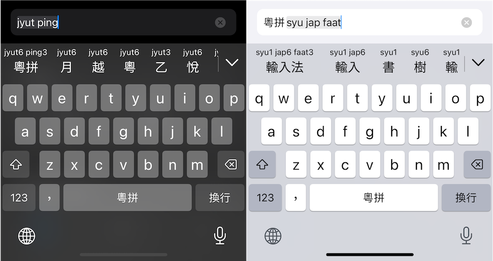

Jyutping
======

粵拼輸入法App. Cantonese Jyutping Keyboard for iOS & macOS.

## iOS & iPadOS

 
 

## macOS
由於 Mac App Store 毋接受輸入法上架，請前往 [Releases](https://github.com/yuetyam/jyutping/releases) 䈎面下載安裝。

## Screenshots

 

## Build requirements
- Xcode 13.4+

## Credits
- [Rime Cantonese](https://github.com/rime/rime-cantonese)
- [OpenCC](https://github.com/BYVoid/OpenCC)

## Support this project

 

